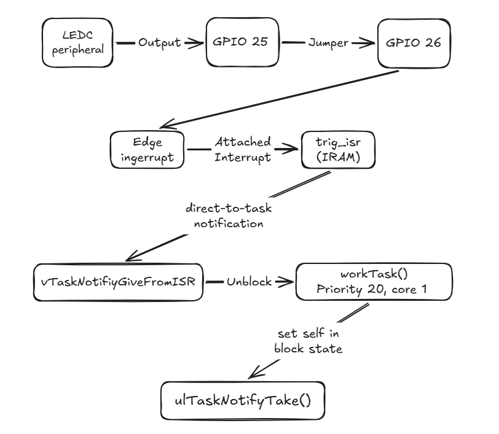

# esp32-freertos-latency-lab

Measuring and defending real-time determinism on an ESP32 under FreeRTOS.

This project works past just programming an ESP32, it aims to analyze its hardware reliability. This project measures the latency of an ISR in IRAM unblocking running a task. 

A hardware signal triggers the interrupt a 1000 times a second and firmware must respond at almost exact timing. In some systems, any delay could result in catastrophe, for this project, being late is a failure. 

Separate tools record every ISR-to-task latency, then (this part is still in progress) using a running average, calculated useful data. 

The lab will be stressed with competing workloads (this part is still in progress) like buses, blocking, flash writes, network traffic, etc. Switched on and off at runtime while the witness keeps recording.

The deliverable (this part is still in progress) includes sets of data from hardware tests poised against expected timings and simulations.

> **Status: in progress.**
> The trigger source and interrupt-to-task path are working and characterized in *Current architecture*
> Ran on simulation and hardware. All figures below are
> labelled with where they came from.

---

## Current architecture



**Trigger.** The LEDC PWM peripheral generates a 1 kHz square wave at 50% duty on
GPIO 25, jumpered to GPIO 26. LEDC is a hardware peripheral, so the waveform holds
its timing regardless of what the CPU is doing — that independence is what makes it
usable as a consistent looping trigger, making the measurements accurate. It stands in for a sensor's data-ready pin and will be replaced by one without changing anything downstream.

**Interrupt path.** `trig_isr` is placed in IRAM. This is required, not an
optimization: when flash is being written or erased the instruction cache is
disabled, and a flash-resident handler would be masked out for milliseconds or
panic outright. The handler stays minimal — timestamp, notify, yield.

**Task.** `workTask` blocks itself on start with `ulTaskNotifyTake`, consuming zero CPU while
waiting. `portYIELD_FROM_ISR` forces the reschedule on ISR exit rather than at the
next scheduler tick, which is the difference between microsecond and millisecond
response.

**Response pin.** GPIO 27 is driven high for the duration of the work via direct
register writes (`GPIO.out_w1ts` / `out_w1tc`) rather than `digitalWrite`, which is
too slow to sit inside the measurement. Trigger-edge to response-rise is latency. The task drives the pin low after all its work is done; therefore, the width of the response pulse is execution time.

---

## Measurement methodology

Two independent measurement paths, deliberately:

| Path | Measures | Sees | Available on |
| --- | --- | --- | --- |
| Logic analyzer / VCD | pin edge to pin edge | full path incl. hardware dispatch | simulation only |
| On-chip timestamps | ISR entry to task wake | software path only | simulation + hardware |

Their difference isolates the interrupt dispatch cost, and agreement between two independent methods is the strongest available evidence
that the instrumentation is sound.

---

## Results

### Simulation — Wokwi, 5127 events

| Metric | min | mean | median | p99 | max | σ |
| --- | --- | --- | --- | --- | --- | --- |
| Trigger period (µs) | 999.253 | 1000.000 | 1000.000 | 1000.001 | 1000.001 | 0.010 |
| Latency (µs) | 31.941 | 31.942 | 31.942 | 31.942 | 32.188 | 0.008 |

Unanswered triggers: 0 of 5127.

**Reading these honestly.** The trigger generator is clean — σ of 10 ns is the
VCD's own resolution, so the reference clock is as good as the format can express.

The latency figures are *not* a physical result. A spread of one nanosecond across
five thousand events isn't realistic, it is the signature of a deterministic emulator recomputing the same path with the same output. Simulation validated the **logic** — the interrupt fires, the notification lands, the task wakes, and every trigger got a response; however, meaningful timing data must be from hardware. 

### Hardware

Measured, analysis in progress

---

## Findings log

Short entries, added as they happen. The debugging record is a deliverable.

**LEDC clock source must be pinned.** Left on automatic selection the driver may
choose the internal RC oscillator, which drifts with temperature. Forcing
`LEDC_USE_APB_CLK` ties the reference to the crystal. 80 MHz ÷ (1000 × 1024) =
78.125 divides exactly given LEDC's fractional divider, so the output is 1000.000 Hz
with no inherited rounding error.

**Simulation jitter is implausibly low.** σ = 8 ns over 5127 events. Prompted the simulation/hardware split in methodology above.

---

## Components/Tools

- ESP32 DevKitC v4 (dual-core Xtensa LX6, 240 MHz)
- Jumper: GPIO 25 → GPIO 26
- GPIO 27 free as the response pin
- Multimeter for DC/frequency cross-checks

GPIO 26 uses an internal pulldown so a dislodged jumper reads a clean low and produces zero events rather than plausible-looking noise.

---

## Layout

```
src/main.cpp        firmware
tools/              analysis scripts
  vcd_latency.py    VCD parser: pairs edges, reports latency distribution
data/               committed captures
docs/               diagrams, traces
diagram.json        Wokwi wiring
platformio.ini
```

---

## Build

```bash
pio run                       # build
pio run -t upload             # flash
wokwi-cli .                   # simulate
```

Analyzing a capture:

```bash
python tools/vcd_latency.py wokwi.vcd --trigger D0 --response D1 --csv data/run.csv
```

The parser also reports the trigger period, which is a free check on the reference
clock — if that is not 1000.000 µs with negligible spread, nothing downstream means
anything.

---

## Progress

**Measurement infrastructure.** Hardware trigger · interrupt-to-task path · VCD analysis · on-chip timestamping  

The single-trigger version is the model; where I see it going is multiple independent tasks — like servos on a drone, each needing its update on time — and measuring whether the scheduler holds when they contend.


---

## Open questions

- How much of the 32 µs simulated latency is hardware dispatch versus context
  switch? Requires running both measurement paths simultaneously.
- Does Wokwi model deferred context switches at all? 

---

## License

MIT