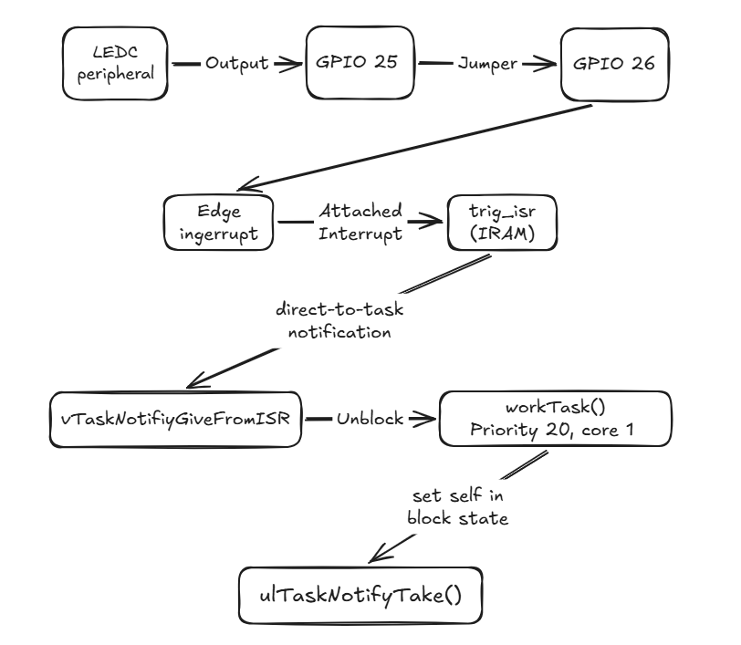
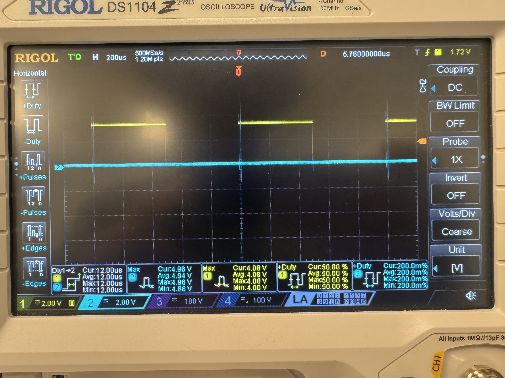
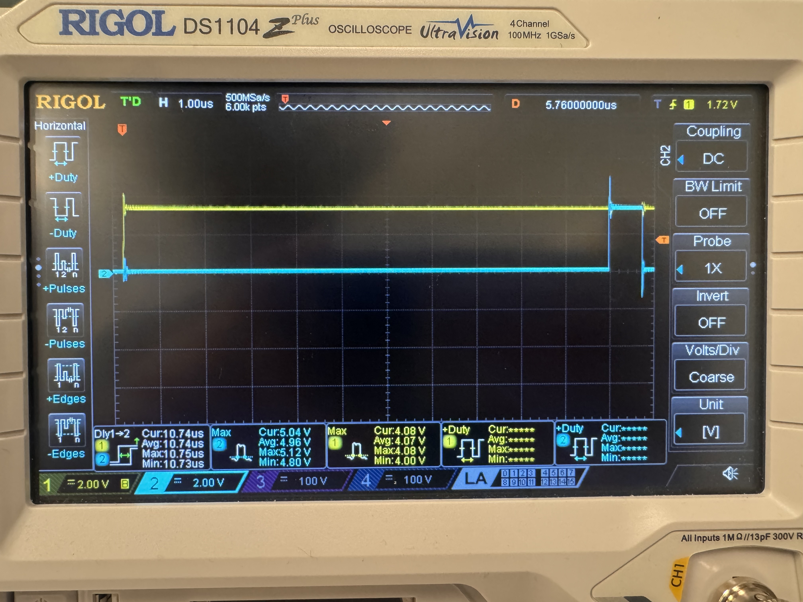

# esp32-freertos-latency-lab


Measuring and defending real-time determinism on an ESP32 under FreeRTOS.


This project works past just programming an ESP32, it aims to analyze its hardware reliability. This project measures the latency of an ISR in IRAM unblocking a task.


A hardware signal triggers the interrupt a 1000 times a second and firmware must respond at almost exact timing. In some systems, any delay could result in catastrophe, for this project, being late is a failure.


Calculate ISR-to-task latency data using a running average and other formula. Records count, min, mean, max, and deadline misses per window, reported once per second from a separate task. (Will expand printed data)


The lab will be stressed with competing workloads (this part is still in progress) like buses, blocking, flash writes, network traffic, etc. Switched on and off at runtime while the witness keeps recording.


The deliverable (this part is still in progress) includes sets of data from hardware tests poised against expected timings and simulations.


> **Status: in progress.**
> Trigger source and interrupt-to-task path are working on hardware with a measured baseline.
> Ran on simulation and hardware. All figures below.


Next: stress the system and record how latency degrades under competing load.


---


## Current architecture





**Trigger.** The LEDC PWM peripheral generates a 1 kHz square wave at 50% duty on
GPIO 25, jumpered to GPIO 26. LEDC is a hardware peripheral, so the waveform holds
its timing regardless of what the CPU is doing — that independence is what makes it
usable as a consistent looping trigger, making the measurements accurate. It stands in for a sensor's data-ready pin and will be replaced by one without changing anything downstream.


**Interrupt path.** `trig_isr` is placed in IRAM. This is required, not an
optimization: when flash is being written or erased the instruction cache is
disabled, and a flash-resident handler would be masked out for milliseconds or
panic outright. The handler stays minimal — timestamp, notify, yield.


**Task.** `workTask()` blocks itself on start with `ulTaskNotifyTake`, consuming zero CPU while
waiting. `portYIELD_FROM_ISR` forces the reschedule on ISR exit rather than at the
next scheduler tick, which is the difference between microsecond and millisecond
response.


**Response pin.** GPIO 27 is driven high for the duration of the work via direct
register writes (`GPIO.out_w1ts` / `out_w1tc`) rather than `digitalWrite`, which is
too slow to sit inside the measurement. Trigger-edge to response-rise is latency. The task drives the pin low after all its work is done; therefore, the width of the response pulse is execution time.


---


## Measurement methodology


Two independent measurement paths, deliberately:


| Path | Measures | Sees | Available on |
| --- | --- | --- | --- |
| Oscilloscope (DS1104Z Plus) | trigger edge → response edge | full path incl. hardware dispatch | external instrument
On-chip timestamps | ISR entry → task wake | software path only | self-reported
Wokwi VCD | pin edge to pin edge | full path, modelled | simulation only|


Their difference isolates the interrupt dispatch cost, and agreement between two independent methods is the strongest available evidence
that the instrumentation is sound.


---


## Results


### Simulation


The Wokwi simulations found a 0.008 standard deviation. A spread of eight nanosecond across
five thousand events isn't realistic, it is the signature of a deterministic emulator. Simulation validated the **logic** — the interrupt fires, the notification lands, the task wakes, and every trigger got a response; however, timing data must be from hardware.


### Hardware


**On-chip**


| Condition | Samples | min (µs) | mean (µs) | max (µs) | Misses | Miss rate |
| --- | --- | --- | --- | --- | --- | --- |
| Idle baseline | 1000 | 9.075 | 9.075 | 9.191 | 0 | 0% |


Baseline with no competing load. `workTask()` performs no application work; it only records timing, so this is the floor for the interrupt-to-task path on this hardware.


Threshold set at 100 µs, roughly 10× the idle baseline and 10% of the 1 ms period. Not a physical deadline; chosen to flag anomalous samples during stress testing.


**Osiliscope**








| Condition | Samples | min (µs) | mean (µs) | max (µs) | Misses |
| --- | --- | --- | --- | --- | --- |
| Idle baseline | on-chip | 1000 | 9.075 | 9.075 | 9.191 |
| Idle baseline | scope, short capture | — | 10.70 | 10.72 | 10.74 |
| Idle baseline | scope, 5+ min run | — | 10.70 | 10.72 | 11.64 |


The scope measures from the electrical edge; the on-chip timestamp starts once `trig_isr` is already executing. The ~1.65 µs difference is interrupt dispatch where the ESP32 vectoring to the handler. The software measurement is structurally blind to it.


Short captures show 40 ns of spread; however, runs past ~5 minutes show a max of 11.64 µs, about the cost of one extra interrupt. The rare event is a hard to track worst case.


---


## Findings log


Short entries, added as they happen. The debugging record is a deliverable.


**The LEDC clock source must be pinned.** Left on automatic selection the driver may
choose the internal RC oscillator, which drifts with temperature. Forcing
`LEDC_USE_APB_CLK` ties the reference to the crystal. 80 MHz ÷ (1000 × 1024) =
78.125 divides exactly given LEDC's fractional divider, so the output is 1000.000 Hz
with no inherited rounding error.


**Simulation jitter is implausibly low.** σ = 8 ns over 5127 events. Prompted the simulation/hardware split in methodology above.


**Logging inside the measured path** Printing inside of `workTask()` inflated measured latency from ~1,600 to ~121,000 cycles (~6.6 µs → ~504 µs) and cut throughput from 1000 to ~180 samples/sec. Moved reporting to a 1 Hz task.


**Cycle counter vs microsecond timer** esp_timer_get_time() at 1 µs resolution collapsed min/max to the same integer. esp_cpu_get_ccount() at ~4.17 ns resolved a 35-cycle spread.


**Per-sample statistic cost** computing the mean and sqrt inside workTask added ~57 cycles (0.23 µs) and the sqrt promoted to software-emulated double


**Software timestamps cannot see interrupt dispatch.** Scope measures 10.72 µs edge-to-edge; on-chip ISR-to-task measures 9.075 µs. The ~1.65 µs gap is dispatched, invisible to any on-chip measurement.


**Short captures miss the worst case.** Scope jitter over a few seconds is 40 ns. Past ~5 minutes, latency hits a peak of 11.64 µs. These events are rare enough to miss in a short window but could be detrimental to projects that need the precise consistency.


---


## Components


- ESP32 DevKitC v4 (dual-core Xtensa LX6, 240 MHz)
- Jumper: GPIO 25 → GPIO 26
- GPIO 27 free as the response pin
- Multimeter for DC/frequency cross-checks


GPIO 26 uses an internal pulldown so a dislodged jumper reads a clean low and produces zero events rather than plausible-looking noise.


### Tools


- Oscilloscope (DS1104Z Plus), lab access


---


## Layout


```
src/main.cpp        firmware
tools/              analysis scripts
  vcd_latency.py    VCD parser: pairs edges, reports latency distribution
data/              
docs/               diagrams
diagram.json        Wokwi wiring
platformio.ini
```


---


## Build


```bash
pio run                       # build
pio run -t upload             # flash
wokwi-cli .                   # simulate
```


Analyzing a capture:


```bash
python tools/vcd_latency.py wokwi.vcd --trigger D0 --response D1 --csv data/run.csv
```


The parser also reports the trigger period, which is a free check on the reference
clock — if that is not 1000.000 µs with negligible spread, nothing downstream means
anything.


---


## Progress


**Measurement infrastructure.** Hardware trigger · interrupt-to-task path · VCD analysis · on-chip timestamping  


The single-trigger version is the model; where I see it going is multiple independent tasks — like servos on a drone, each needing its update on time — and measuring whether the scheduler holds when they contend.


---


## License


MIT

